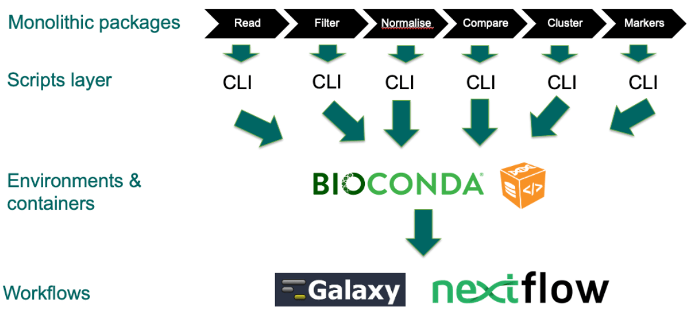
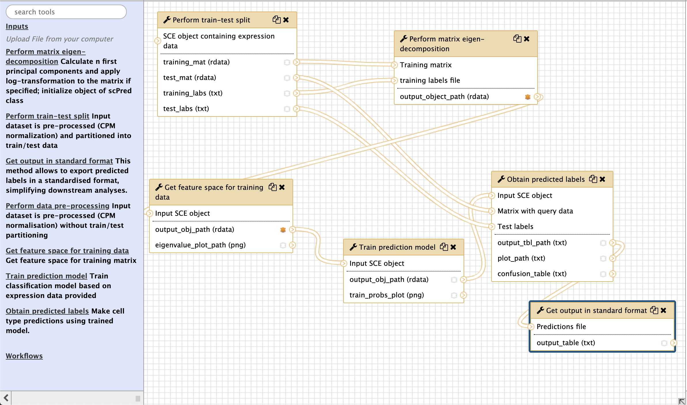

# CellTypeScan Project

## Introduction
Assigning types to cellular expression profiles remains a manual process much of the time, based on specialist knowledge of the expression of key genes in specific biological contexts. Large atlas efforts are ongoing but remain incomplete, meaning that the set of possible reference cells types is still poorly defined, and comprehensive controlled vocabularies for annotating cell types are not available. Thus, author-provided cell type information is likely to remain incomplete even when reference atlases and ontologies are complete.

For these reasons, it is desirable to use automated methods to provide putative assignments of cells to type. Many cell type assignment methods exist, but their relative merits and effectiveness in real-world contexts are unknown. CellTypeScan is a project aimed at developing methodology and tools to incorporate cell typing methods into the SCXA workflow. CellTypeScan is in part inspired by InterProScan, a tool used for generating a consensus prediction of protein domains using a variety of independent methods. The general methodology of the project is outlined below. 

In summary, following generation of expression profiles, we will run an ensemble of cell type predictors to compare query expression profiles against our database of curated cell types and automated clusterings. Even if a cell cannot be reliably assigned to an actual type based on its expression, cells with similar profiles can be identified in other experiments, which may help to shed light on the role of that cell in the experiment at hand.

## Methodology
This is the approach we have taken in building the infrastructure for this project:

* Write Bash wrapper scripts to pass arguments to wrapped functions and retrieve output
* Package scripts using Bioconda
* Write workflows to execute tools in two scenarios:
    * Tool evaluation where the ‘correct answer’ is known
    * Cell type prediction for unannotated cell types

## Performance evaluation 
For testing cell typing methods against annotated cell types, tools will be evaluated using 5-fold cross-validation on training data set. A [nextflow pipeline]() has initially been developed to automate this task, followed by creating corresponding Galaxy components (see examples below). 

The statistics we use in assessment build on those used in [this study](https://github.com/tabdelaal/scRNAseq_Benchmark):
* percentage of unlabelled cells
* change in the percentage of unlabelled cells in predicted labels vs reference labels
* proportion of exact matches between predicted and reference labels (exact matching)
* average proportion of shared words between reference and predicted labels (partial matching)
* accuracy & median F1-score
* average semantic similarity between predicted and reference labels

For cross-validation, final reported performance will be the mean of the performance achieved for each ‘fold’.

## Integration with Single-cell Expression Atlas 
In a production scenario we are interested in generating reliable predictions for unseen data. A common strategy in this case is to use consensus-based predictions from multiple tools. Because each prediction tool requires its own index structure/ classifier, we will build a library of such classifiers that are then available for cell tying with new data. 

Predictions will be collated and analysed for consistency using a two-step strategy. Firstly, predictions will be filtered at the level of individual tools. For each tool, classifier outputs that produce best-matching predictions will be selected based on similarity score (e.g. a distance metric or a p-value). Secondly, top predictions from each tool will be collated and analysed for consistency and semantic similarity. Tables with most likely consensus predictions and their corresponding scores will be produced. Similar to the performance evaluation use case, Nextflow pipelines were initially produced, replicated by Galaxy pipelines to provide garphical user interface. 

## Results to date 

### Command-line interfaces 
The following CLI components have been developed:

Scmap: https://github.com/ebi-gene-expression-group/scmap-cli

Garnett: https://github.com/ebi-gene-expression-group/garnett-cli

scPred https://github.com/ebi-gene-expression-group/scpred-cli

These components are now available for incorporation into workflows in whatever combination required. 

### New components
Scripts for generating prediction scores and p values for cell type predictions are available in a repository and Conda package - see https://github.com/ebi-gene-expression-group/cell-types-analysis. 

### Workflows 

**Evaluation** 

The following Nextflow workflows have been built for running the native workflows of the associated tools for use in performance assessment:

https://github.com/ebi-gene-expression-group/scmap-workflow

https://github.com/ebi-gene-expression-group/garnett-workflow

https://github.com/ebi-gene-expression-group/scpred-workflow

**Production**

For use in production context, separate Nextflow workflows have been constructed:

https://github.com/ebi-gene-expression-group/scpred-predict-workflow

https://github.com/ebi-gene-expression-group/garnett-predict-workflow

**Coordination**

We are further developing a Nextflow wrapper workflow that will coordinate performance evaluation (https://github.com/ebi-gene-expression-group/cell-types-eval-control-workflow-cross-validation) and prediction (https://github.com/ebi-gene-expression-group/labels-prediction-workflow).

### Galaxy tools 
The CLI conda packages have been implemented as Galaxy tools, which allows to use them to duplicate pipelines created in Nextflow 

https://github.com/ebi-gene-expression-group/container-galaxy-sc-tertiary/tree/develop/tools/tertiary-analysis/garnett

https://github.com/ebi-gene-expression-group/container-galaxy-sc-tertiary/tree/develop/tools/tertiary-analysis/scmap

https://github.com/ebi-gene-expression-group/container-galaxy-sc-tertiary/tree/feature/scpred

