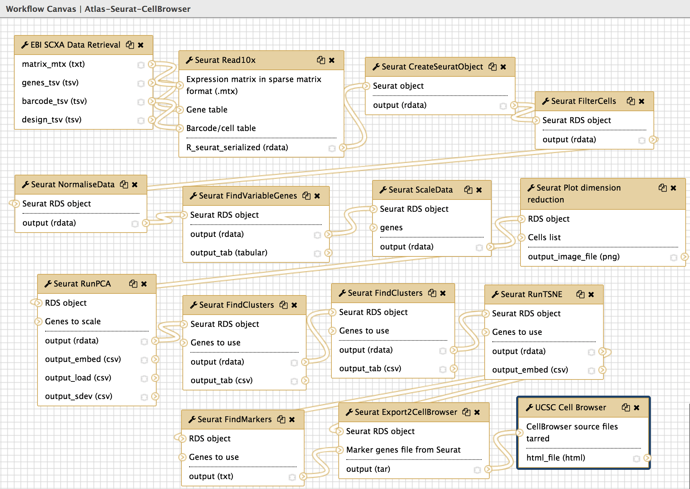
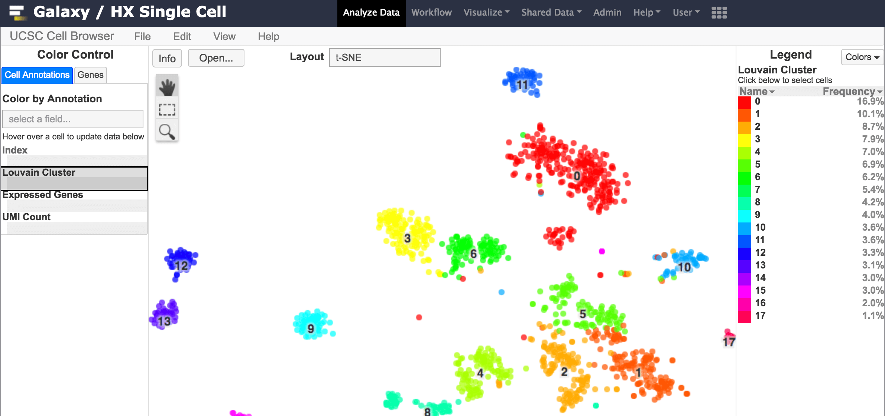

[](https://quay.io/repository/ebigxa/galaxy-sc-tertiary)

# SCiAp Galaxy Tools

This repo holds the Galaxy tools wrapped for SCiAp - Single Cell Interactive Analysis Platform.

This Galaxy flavour aims to support computational scRNA-Seq data analysis in the
context of the Human Cell Atlas (HCA) Project, all the tools available here are available for use for free at the the Human Cell Atlas Galaxy instance within usegalaxy.eu at https://humancellatlas.usegalaxy.eu/. For more details, see our [paper](https://www.nature.com/articles/s41592-021-01102-w). 

Currently you can use the different components of Seurat, Scanpy, SC3, Monocle3 and Scater
to make workflows in a user friendly manner. We also provision an embedded version
of UCSC CellBrowser, for interactive visualisation of Seurat and Scanpy results.


Figure 1: Seurat, processing data from Atlas and redirecting it to UCSC CellBrowser


Figure 2: Embedded visualisation with Seurat.

In upcoming releases we expect to have:
- Major interoperability between the different
tools components through the Loom interexchange format. This will enable workflows
using different components of Seurat, Scater/Sc3 and Scanpy.
- Additional visualisers, such as cellxgene.

## Simple run

To run this Galaxy instance through minikube locally follow these [instructions](https://tertiary-workflows-docs.readthedocs.io/en/v1.0.0/running_galaxy_sc_locally.html).

## On a cloud provider

To run on a cloud provider you need:

- A running Kubernetes (k8s) cluster.
- Shared file system that can be mounted from all nodes of the k8s cluster.
  - Normally the easiest is to have a Persistent Volume (PV) associated to this shared file system, and then create a Persistent Volumen Claim (PVC) to bind to this PV. Then give the name of the PVC in the field `persistence.existingClaim` and make sure that `persistence.minikube.enabled: false`
  in the helm configuration file used to run `helm install -f <config-file> galaxy-helm-repo/galaxy-stable`.

For more details see these [instructions](https://tertiary-workflows-docs.readthedocs.io/en/v1.0.0/running_hx_single_cell_cloud_provider.html).

## Advanced: use your own flavour of the container

### Building this container

To build this container simply execute in the root directory of this repo:

```
docker build -t <desired-docker-owner>/galaxy-sc-init:<desired-tag> -f Dockerfile_init .
```

Then push your container to docker registry with `docker push`.

### Running in minikube

Follow these [instructions](https://tertiary-workflows-docs.readthedocs.io/en/v1.0.0/running_galaxy_sc_locally.html)
to setup your environment if you haven't (only follow until before "Normal Run"). In that setup, the
helm configuration for the galaxy-stable chart, available on this repo at `helm-configs/`, is used.
To make use of the container that you just built, in your local copy of the helm config file, set the
init part to:

```yaml
init:
  image:
    repository: <desired-docker-owner>/galaxy-sc-init
    tag: <desired-tag>
    pullPolicy: Always
  force_copy: "__venv__,__config__,__galaxy-central__,__tools__"
```

Then proceed with the instructions for the
[normal run](https://tertiary-workflows-docs.readthedocs.io/en/v1.0.0/running_galaxy_sc_locally.html#normal-run)
in the previously mentioned page.

# Building community images

If for whatever reason you are more involved with Galaxy development (or ansible-galaxy-extras roles) itself and you need some of those changes to be used within a deployment of the type described here, then you will need to re-build the community images and use those within the settings configured in the helm config described above. For that, you need to execute the script `compose/build-orchestration-images.sh` with adequate arguments (see usage of that script) within https://github.com/bgruening/docker-galaxy-stable/ repo for community images. If you are happy to use Galaxy as it is from its release versions, you don't need to use this section at all and simply stay with directions up to the previous section.

# Development: test data download

Given that for some single cell tools it is difficult or time comsuming to reduce test file sizes, the GitHub Actions CI now contain the following optional mechanism to download test data on demand.

In the specific tool folder, place a bash script named `get_test_data.sh`, which should contain all the logic to retrieve and rename any desired files (from any location) into the test-data directory of that tool. The script should be written considering that it will be run with the specific tool directory as the working directory.
