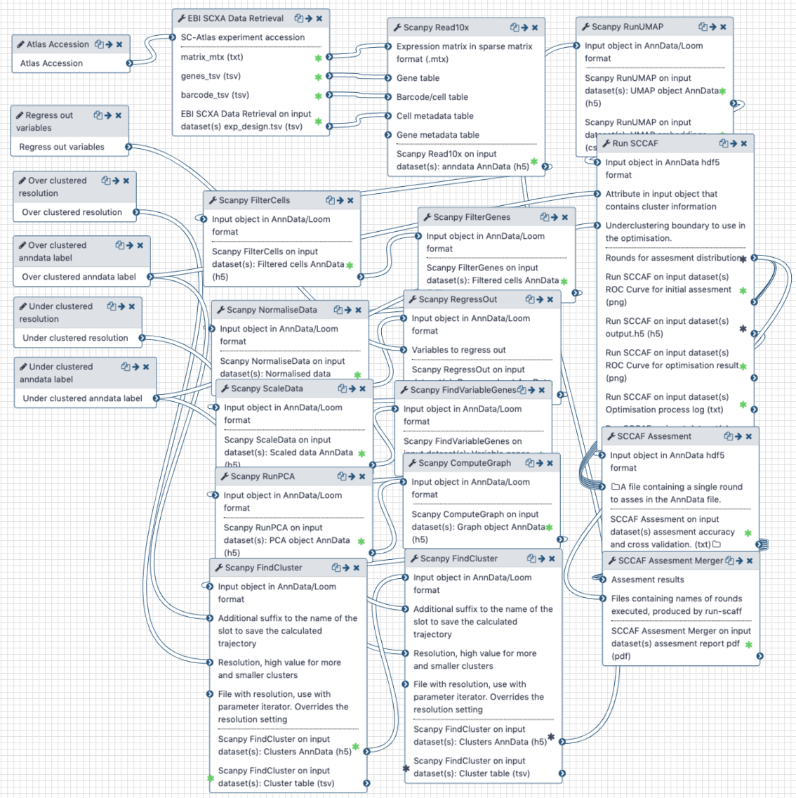

# Available workflows

The command-line-interface layer allows deployment of tools in any workflow environment. 

## Galaxy

Table S3 below gives a summary of example workflows where different tools are deployed in Galaxy. Note in particular the use intermediate exchange formats or conversions to connect disparte tools. The sections below explain in more detail each of the workflows.

**Table S3**: Workflows with links to  Galaxy instance and to their source definition, assigned to one or more of the relevant analysis areas: Clustering (**C**), Differential expression/Marker detection (**DE-MD**), Trajectories (**T**), Cell type alignment (**CT**) and Dimensionality reduction (**DR**). All the workflow source files are available [here](https://github.com/ebi-gene-expression-group/container-galaxy-sc-tertiary/tree/develop/workflows).

| Workflow | Description | Analysis areas |
|----------|-------------|----------------|
| [Atlas-Scanpy-CellBrowser](https://humancellatlas.usegalaxy.eu/u/pmoreno/w/atlas-scanpy-cellbrowser-imported-from-uploaded-file) | Retrieves data from Single Cell Expression Atlas for a given accession, filters, normalise, clusterise, marker genes and calculate dimensional reduction with Scanpy. Visualise interactively with UCSC CellBrowser | C DR DE IV |
| [Atlas-Seurat-CellBrowser](https://humancellatlas.usegalaxy.eu/u/pmoreno/w/atlas-seurat-cellbrowser-imported-from-uploaded-file) | Retrieves data from Single Cell Expression Atlas for a given accession, filters, normalise, clusterise, marker genes and calculate dimensional reduction with Seurat. Visualise interactively with UCSC CellBrowser | C DR DE IV |
| [SC-Atlas-Production](https://humancellatlas.usegalaxy.eu/u/pmoreno/w/scanpy-prod-13-smart-imported-from-uploaded-file) | Filtering, normalization, clustering, marker genes and dimensionality reduction used to process every dataset shown in the Single Cell Expression Atlas release 5 and 6 | C DR DE |
| [HCA-Scanpy-CellBrowser](https://humancellatlas.usegalaxy.eu/u/pmoreno/w/hca-scanpy-cellbrowser) | Retrieves data from Human Cell Atlas for a given accession, filters, normalise, clusterise, marker genes and calculate dimensional reduction with Scanpy. Visualise interactively with UCSC CellBrowser | C DR DE IV |
| [Atlas-Scanpy-SCCAF](https://humancellatlas.usegalaxy.eu/u/pmoreno/w/atlas-scanpy-sccaf)* | Retrieves data from Single Cell Expression Atlas, preprocess and clusterise with Scanpy at two different resolutions and search for best clustering with SCCAF after batch correcting. | C DR DE BC |
| [Atlas-Scanpy-SCMap](https://humancellatlas.usegalaxy.eu/u/pmoreno/w/atlas-scanpy-scmap)* | Retrieves data from Single Cell Expression Atlas, preprocess and map to an SCMap cell index | C CT |

### Atlas Scanpy CellBrowser

This workflow (available [here](https://humancellatlas.usegalaxy.eu/u/pmoreno/w/atlas-scanpy-cellbrowser-imported-from-uploaded-file) at the Human Cell Atlas Galaxy instance) retrieves quantified data matrix
in 10x format from the Single Cell Expression Atlas through an accession number. The data is transformed
into AnnData, the format used by Scanpy, and then a downstream analysis is carried out with Scanpy. This analysis first filters the matrix by cells and genes attributes, normalises it, find variable genes, scale it, run PCA, compute the k-nn graph, find clusters, marker genes and calculate tSNE and UMAP projections. The final result is passed to UCSC CellBrowser for interactive visualisation based on the calculated embeddings. Each of the steps provides a number of parameters to adapt for particular uses and datasets.

### Atlas Seurat CellBrowser

This workflow, is analogous to the previous one, but uses instead of Scanpy the downstream analysis steps of Seurat.

### SC Atlas Production

This workflow was used for releases 4, 5 and 6 of the EBI Single Cell Expression Atlas. Currently it relies mostly on Scanpy steps, but as interoperability improves, some of the analysis
steps could be changed to other software providers. It distributes generation of tSNE plots across different persplexity values and clusters through a set of resolutions. This workflow mostly generates text files that are loaded into databases and indexes for expression atlas, so no interactive modules or plots are generated, and is provided to enable reproducibility of our results.

### Human cell atlas Scanpy CellBrowser

Equivalent to the first workflow using EBI Single Cell Atlas downloader, Scanpy modules and CellBrowser, but using the Human Cell Atlas matrix service as input.

### Atlas Scanpy SCCAF

This workflow helps in the decision of the number of clusters to pick for a dataset through the use of the SCCAF tool. It will run Scanpy with two different resolution values, a high resolution and a low resolution, and through a machine learning process provide an assessment of adequate clustering in between these settings to prefer for the dataset at hand.

### Atlas Scanpy SCMap

This workflow does the downstream analysis with Scanpy for one Atlas dataset and projects it through SCMap at the level of cells and clusters to cell and clusters indexes provided in a format that SCMap can read. The scanpy analysis is exported as Loom file and transformed into SingleCellExperiment by the SCEasy conversion module.

## Nextflow

Table S4 below shows examples where tools of the same packages are deployed in Nextflow workflows. Areas: Cell type prediction (**CTP**), QC/ preprocessing (**QC/P**). 

| Workflow | Description | Analysis areas |
|----------|-------------|----------------|
| [scmap-prod-workflow](https://github.com/ebi-gene-expression-group/scmap-prod-workflow]) | A workflow to predict cell types using scmap, incorporating tools of the [DropletUtils CLI](https://github.com/ebi-gene-expression-group/dropletutils-scripts) | CTP |
| [garnett-prod-workflow](https://github.com/ebi-gene-expression-group/garnett-prod-workflow) | A workflow to predict cell types using Garnett, incorporating tools of the [Monocle CLI](https://github.com/ebi-gene-expression-group/monocle-scripts) | QC/P |
| [droplet-quantification-workflow](https://github.com/ebi-gene-expression-group/scxa-droplet-quantification-workflow/blob/develop/main.nf) | A workflow used by the Atlas team for quantifying droplet single-cell experiments, incorporating tools of the [DropletUtils CLI](https://github.com/ebi-gene-expression-group/dropletutils-scripts) | QC/P | 
